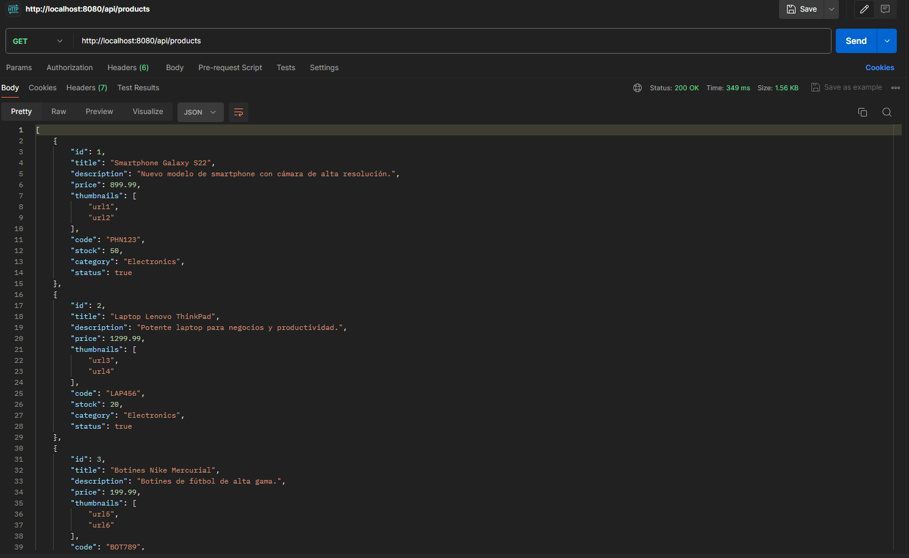
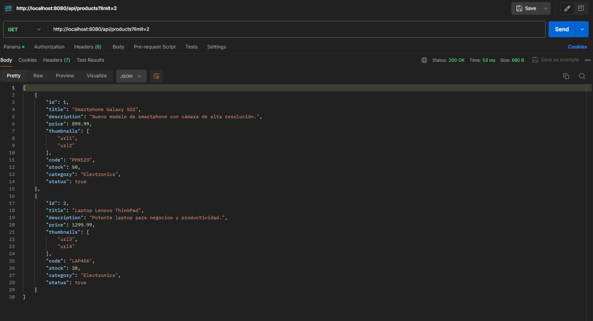
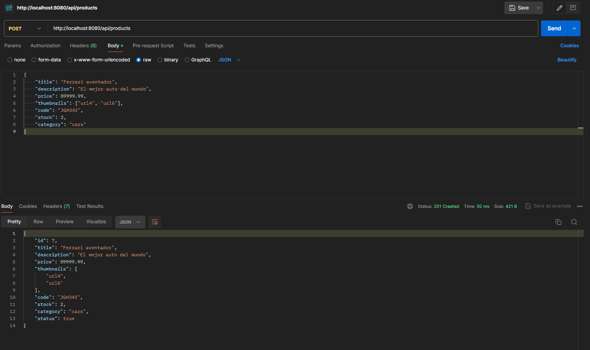
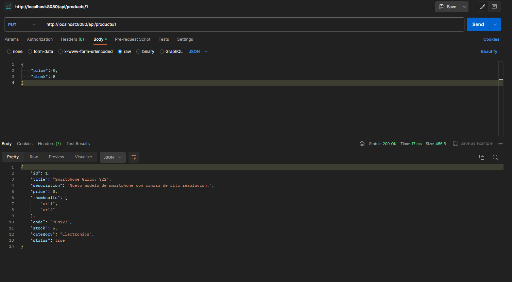

# E-Commerce API

## Descripción

Este proyecto es una API de eCommerce construida utilizando Node.js y Express. La API permite la gestión de productos y carritos de compras, ofreciendo funcionalidades para crear, leer, actualizar y eliminar productos, así como crear carritos y gestionar los productos dentro de ellos. Los datos se almacenan en archivos JSON para simplicidad y facilidad de uso.

## Características

- Gestión de productos:
  - Crear productos.
  - Leer productos individuales y listados de productos.
  - Actualizar productos.
  - Eliminar productos.
- Gestión de carritos de compras:
  - Crear carritos de compras.
  - Listar productos dentro de un carrito específico.
  - Agregar productos a un carrito, con la capacidad de actualizar la cantidad de productos si ya existen en el carrito.

## Instalación

1. **Clonar el repositorio:**

    ```sh
    git clone https://github.com/FeliPanda/Ecommerce.git
    cd ecommerce
    ```

2. **Instalar dependencias:**

    ```sh
    npm install
    ```

3. **Crear archivos de datos:**

    Asegúrate de que los archivos `products.json` y `carts.json` existen en el directorio raíz del proyecto y contienen un JSON válido. Puedes iniciar con archivos vacíos:

    ```json
    []
    ```

## Uso

1. **Iniciar el servidor:**

    ```sh
    usa un script  "start": " node --watch app.js"
    npm start
    ```

2. **Endpoints Disponibles:**

    ### Productos

    - **Obtener todos los productos:**

        ```http
        GET http://localhost:8080/api/products
        ```

        Respuesta:

        

       

    - **Obtener un producto por ID:**

        ```http
        GET /api/products/:pid
        ```

        Respuesta:

        

    - **Agregar un nuevo producto:**

        ```http
        POST /api/products
        ```

        Cuerpo de la solicitud:

        ```json
        {
            "title": "Ferrari aventador",
            "description": "El mejor auto del mundo",
            "price": 89999.99,
            "thumbnails": ["url4", "url6"],
            "code": "JGH343",
            "stock": 2,
            "category": "cars"
        }
        ```
        
        Respuesta:

        

    - **Actualizar un producto:**

        ```http
        PUT /api/products/:pid
        para el ejemplo a continuacin:
        http://localhost:8080/api/products/1
        ```

        Cuerpo de la solicitud (solo los campos a actualizar):

        ```json
        {
            "price": 0,
            "stock": 5
        }
        ```
        Respuesta:

        

    - **Eliminar un producto:**

        ```http
        DELETE /api/products/:pid
        ```

    ### Carritos

    - **Crear un nuevo carrito:**

        ```http
        POST /api/carts
        ```

        Respuesta:

        ```json
        {
            "id": "ydf",
            "products": []
        }
        ```

    - **Obtener productos de un carrito por ID:**

        ```http
        GET /api/carts/:cid
        ```

        Respuesta:

        ```json
        [
            {
                "id": 1,
                "title": "Smartphone Galaxy S22",
                "description": "Nuevo modelo de smartphone con cámara de alta resolución.",
                "price": 899.99,
                "thumbnails": ["url1", "url2"],
                "code": "PHN123",
                "stock": 50,
                "category": "Electronics",
                "status": true,
                "quantity": 1
            },
            ...
        ]
        ```

    - **Agregar un producto a un carrito:**

        ```http
        POST /api/carts/:cid/products/:pid
        ```

        Cuerpo de la solicitud:

        ```json
        {
            "quantity": 3
        }
        ```

        Respuesta:

        ```json
        {
            "id": 1,
            "title": "Smartphone Galaxy S22",
            "description": "Nuevo modelo de smartphone con cámara de alta resolución.",
            "price": 899.99,
            "thumbnails": ["url1",
